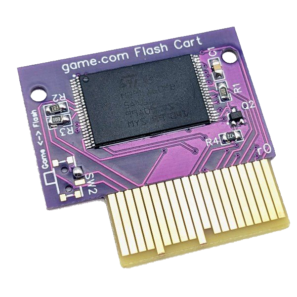

# game.flash
A Flash cartridge for the Tiger game.com handheld.
Still in the works.

## Cartridge PCB

### BOM
| **Reference** | **Part** | **Link** |
|---------|------|------|
|U1 | M29F160FB5AN6F2 2 MB Flash | [Digikey](https://www.digikey.de/en/products/detail/alliance-memory-inc/M29F160FB5AN6F2/12180105)|
|R1, R2, R3 | 10 kOhm Resistor (0805) | [LCSC](https://www.lcsc.com/product-detail/Chip-Resistor-Surface-Mount_UNI-ROYAL-Uniroyal-Elec-0805W8F1002T5E_C17414.html) |
|R4 | 4.7 kOhm Resistor (0805) | [LCSC](https://www.lcsc.com/product-detail/Chip-Resistor-Surface-Mount_UNI-ROYAL-Uniroyal-Elec-0805W8F4701T5E_C17673.html)
|C1 | 100 nF Capacitor (0805) | [LCSC](https://www.lcsc.com/product-detail/Multilayer-Ceramic-Capacitors-MLCC-SMD-SMT_YAGEO-CC0805KRX7R9BB104_C49678.html)
|Q2 | NPN Transistor (SOT-323-3) | [LCSC](https://www.lcsc.com/product-detail/Bipolar-Transistors-BJT_PANJIT-International-MMBT3904W_R1_00001_C142339.html)

The switch SW2 is not actually needed.
Instead, just connect the two pads as shown in the picture.

### Ordering Cartridge PCB
Order the cartridge PCB with ENIG/gold plated, "gold fingers" and chamfered edges.
Since, e.g., JLCPCB needs a minimum size for those features, you can find a panelized version which should fulfill those requirements.

A PCB thickness of 1.0 mm or 1.2 mm should work (1.0 mm works for me well, 1.2 mm is also successfully tested by somebody else).
Original game.com cartridge PCB seem to have a thickness of 1.0 mm or slightly above.
**When ordering thickness of 1.0 mm, you most likely have to slightly adjust the cart edge connector of the flasher PCB (e.g., carefully bend all pins slightly a bit more towards the center to put more pressure on the contacts), as otherwise the PCB is too loose and does not make properly contact (though works without problems for me on the game.com device).**

### Cartridge Case
A 3D printable cartridge case should come soon.

A regular game.com cartridge case *should* work, although the cases seem to have quite some tolerance.
This means that some fit for me, some are too tight.

## Flasher PCB
The Flash chip on the cartridge can be re-flashed using an Arduino Mega and a "flasher shield".

### BOM
| **Reference** | **Part** | **Link** |
|---------|------|------|
|U1 | RBB20DHHN Edge Connector | [Digikey](https://www.digikey.de/en/products/detail/sullins-connector-solutions/RBB20DHHN/927330)

## Flashing Software
Very soon to be uploaded.

## Disclaimer
**Use the files and/or schematics to build your own board at your own risk**.
This board works fine for me, but it's a simple hobby project, so there is no liability for errors in the schematics and/or board files.
**Use at your own risk**.
